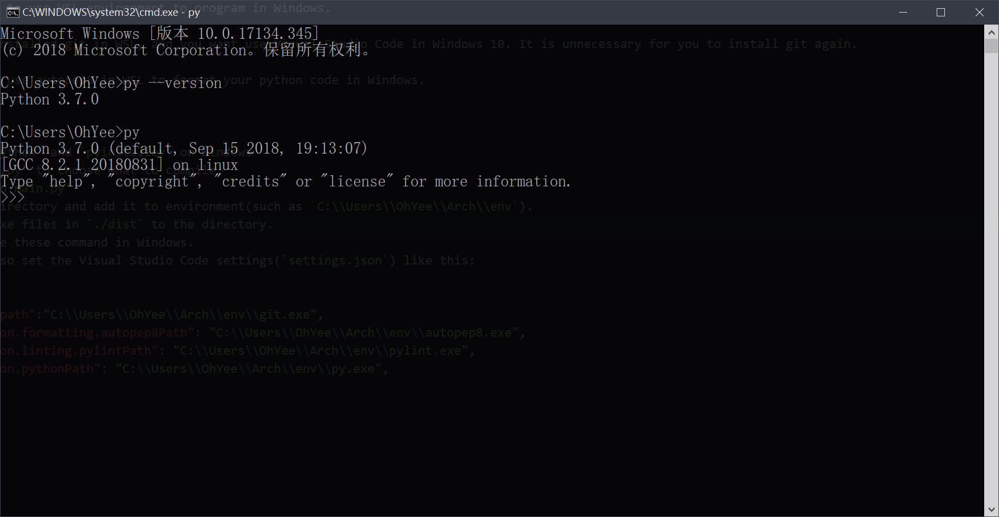

# Use WSL Environment to Program

Redirect the Windows commend to WSL commend.

Such as `gcc D:\\a.c -o E:\\a.exe` will be `wsl gcc /mnt/d/a.c -o /mnt/e/a.exe`

It is helpful to use WSL environment to program in Windows.

If you have installed git in WSL, and you want use Visual Studio Code in Windows 10. It is unnecessary for you to install git again.

Also, you can use autopep8 in WSL to format your python code in Windows.

The image shows that Windows runs Python on Linux.


# Compile

1. Install `python` and `pyinstaller` on Windows
2. Edit `main.py` to choose what you want to compile.
3. Run `python main.py`
4. Choose a directory and add it to environment(such as `C:\\Users\\OhYee\\Arch\\env`).
5. Copy the exe files in `./dist` to the directory.
6. You can use these command in Windows.
7. For instance, you can also set the Visual Studio Code settings(`settings.json`) like this:
    ```json
    {
        "git.path": "C:\\Users\\OhYee\\Arch\\env\\git.exe", 
        "python.formatting.autopep8Path": "C:\\Users\\OhYee\\Arch\\env\\autopep8.exe",
        "python.linting.pylintPath": "C:\\Users\\OhYee\\Arch\\env\\pylint.exe",
        "python.pythonPath": "C:\\Users\\OhYee\\Arch\\env\\python.exe",
    }
    ```

